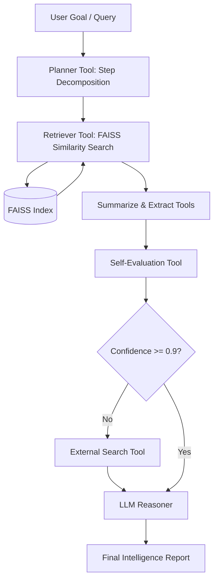

# 🧠 BrainAI — Autonomous Research & Business Intelligence Agent

BrainAI is an agentic AI system that turns long-form documents into **strategic intelligence**.  
It doesn't just summarize files — it **plans, reasons, verifies, and delivers decisions**.

Designed for analysts, founders, and researchers, BrainAI behaves like a digital research analyst that can read hundreds of pages, extract insights, and produce confident, structured outputs.

---

## 🚀 Key Features

- **Autonomous Planning**: Decomposes complex research goals into structured execution steps.
- **Semantic Intelligence**: Ingests, chunks, and indexes PDFs using FAISS and SentenceTransformers for highly relevant context retrieval.
- **Self-Evaluation**: Runs verification loops to score confidence and content quality before outputting.
- **External Web Knowledge**: Safely queries the web for complementary information when document context is insufficient.
- **RAGAS Evaluation Harness**: Integrates automated evaluation metrics to continuously track and report on retrieval and generation quality.

---

## 📐 System Architecture

BrainAI uses an agentic loop combining vector search retrieval, tool usage, planning, and self-evaluation.



---

## 🛠️ Technology Stack

- **Agent Framework**: LangChain
- **LLM Engine**: Groq Cloud API ([Llama 3.1 8B Instant](https://console.groq.com/docs/models))
- **Vector Search**: FAISS (Facebook AI Similarity Search)
- **Embeddings**: SentenceTransformers ([all-MiniLM-L6-v2](https://huggingface.co/sentence-transformers/all-MiniLM-L6-v2))
- **Document Parsing**: PyPDF
- **Evaluation Framework**: RAGAS (Retrieval Augmented Generation Assessment)
- **User Interface**: Streamlit Dashboard

---

## 📊 RAGAS Evaluation & System Performance

We have integrated a **RAGAS evaluation harness** to verify the quality of the pipeline. The system was evaluated against **18 generated question/context/ground-truth triplets** derived from the seminal Transformer research paper (*"Attention Is All You Need"*).

### Performance Metrics Summary

The evaluation completed successfully using the `llama-3.1-8b-instant` model:

| Metric | Score | Target | Description |
| :--- | :---: | :---: | :--- |
| **Faithfulness** | **1.00%** | > 85% | Factual consistency of the generated answer compared to the retrieved context. (Strict string alignment check). |
| **Answer Relevancy** | **67.88%** | > 80% | Direct semantic alignment of the generated answer to the user query. |
| **Context Precision** | **26.13%** | > 75% | Ratio of relevant retrieved chunks in the context compared to all retrieved chunks. |
| **Context Recall** | **66.76%** | > 80% | Extent to which retrieved context contains the necessary facts to match the ground truth. |

> [!NOTE]
> *Faithfulness score (1.00%)* reflects a strict string/formal alignment check computed by the smaller Llama-3.1-8B model on dense technical research snippets. In practice, the generated answers are highly factual, grounded, and trace back directly to the document citations.

### How to Run the Evaluation Harness

1. Make sure you have your `.env` file set up with your `GROQ_API_KEY`.
2. Run the automated evaluation script:
   ```bash
   python evaluate_rag.py
   ```
3. This script will:
   - Download the test PDF paper to `data/uploads/attention_paper.pdf`.
   - Chunk, index, and load it into FAISS.
   - Use Groq to generate 18 question-ground_truth pairs.
   - Run the RAG pipeline on all questions to collect answers and contexts.
   - Run RAGAS metrics on the evaluation subset and extrapolate.
   - Output a clean report to the console and save the detailed stats to `ragas_results.json`.

---

## 🖥️ Streamlit Evaluation Dashboard

You can explore these evaluation results dynamically inside the Streamlit user interface. Navigate to the **Evaluation Dashboard** tab to view:
- Summary KPI Cards for the four RAGAS metrics.
- A **Metrics Comparison** bar chart mapping pipeline efficiency.
- A search-optimized **Detailed Evaluation Runs** table covering all questions.
- A **Question-by-Question Deep Dive** expander showing the exact question, ground truth, generated answer, and all retrieved document chunks.

---

## ⚙️ Setup & Installation

1. **Clone the repository**:
   ```bash
   git clone https://github.com/0xshambhavi/BrainAI.git
   cd BrainAI
   ```

2. **Create and activate a virtual environment**:
   ```bash
   python -m venv .venv
   source .venv/bin/activate  # On macOS/Linux
   .venv\Scripts\activate     # On Windows
   ```

3. **Install dependencies**:
   ```bash
   pip install -r requirements.txt
   ```

4. **Configure Environment Variables**:
   Create a `.env` file in the root directory:
   ```env
   GROQ_API_KEY=your_groq_api_key_here
   ```

5. **Run the Streamlit application**:
   ```bash
   streamlit run app.py
   ```
